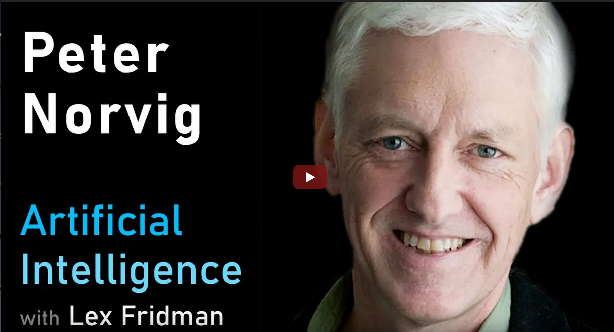

# Transcript of interview to Peter Norvig by Lex Fridman

## Peter Norvig: Artificial Intelligence: A Modern Approach | Artificial Intelligence (AI) Podcast | Sep 30, 2019

This is a quick transcript of the interview of Peter Norvig by Lex Fridman. I find this interview so interesting and revealing, that I decided to  take on the task of making a transcript of the interview published in YouTube. Enjoy. *Alfonso R. Reyes. Houston, Texas.*

## Introduction by Lex Fridman

The following is a conversation with Peter Norvig. He's a director of [Research Google](), co-author with Stuart Russell of the book "Artificial Intelligence: A Modern Approach", and educated and inspired a whole generation of researchers, including myself, to get into the field of Artificial Intelligence. This is the Artificial Intelligence podcast. If you enjoy it, subscribe on YouTube; give it five stars in iTunes; support on Patreon; or simply connect with me on Twitter at @[lexfridman](). And now here's my conversation with Peter Norvig.

## Start of Interview

**[Lex]** Most researchers in the AI community, including myself, own all three editions, red green and blue, of the ["Artificial intelligence: A modern approach"](), the field defining textbook, as many people are aware, that you wrote with [Stuart Russell](). How has the book changed? And how have you changed in relation to it from the first edition to the second, to the third, and now fourth edition as you work on it?

**[Peter]** Yeah. So, it's been a lot of years, a lot of changes. One of the things changing from the first to, maybe the second, or third was just the rise of computing power, right? So, I think in the in the First Edition we said: "Here's [predicate logic]() but that only goes so far because pretty soon you have millions of short little predicate expressions, and they can't possibly fit in memory, so we're gonna use [first-order logic]() that's more concise." And then, we quickly realized: "Oh, predicate logic is pretty nice because there are really fast solvers and other things. And look, there's only millions of expressions and that fits easily into memory, or maybe even billions fit into memory now." So, that was a change of the type of technology we needed just because the hardware expanded.

**[Lex]** Even to the second edition resource constraints from loosened significantly?

**[Peter]** Yeah.

**[Lex]** Second, and now in early 2000s second edition?

**[Peter]** Right. So, 95 was first, and then 2000, 2001 or so, and then moving on from there. I think we're starting to see that again with the [GPU]()s, and then more specific type of machinery like the [TPU]()s, and you're seeing custom [ASIC]()s, and so on for deep learning. So, we're seeing another advance in terms of the hardware. Then, I think another thing that we especially notice this time around is - in all three of the first editions- we kind of said: "Well, we're gonna find AI as maximizing expected utility, and you tell me your [utility function]()." And now we've got 27 chapters where the cool techniques for how to optimize them. I think in this edition we're saying more: "You know what? Maybe that optimization part is the easy part and the hard part is deciding what is my utility function? What do I want? And if I'm a collection of agents, or a society, what do we want as a whole?"

**[Lex]** You touch that topic in this edition, you get it a little bit more into utility?

**[Peter]** Yeah.

**[Lex]** That's really interesting. On a technical level, or almost pushing the philosophical?

**[Peter]** I guess it is philosophical, right? So, we've always had a philosophy chapter which I was glad that we were supporting, and now it's less kind of the [Chinese Room]() type argument and more of these ethical and societal type issues. So, we get into the issues of fairness, and bias, and just the issue of aggregating utilities.

**[Lex]** So, how do you encode human values into an utility function? Is this something that you can do purely through data in a learned way? Or is there some systematic ... Obviously, there's no good answers yet; there's just beginnings to this to even opening ...

**[Peter]** So, there is not one answer. Yes, there are techniques to try to learn that. So, we talked about [inverse reinforcement learning](), right? So, [reinforcement learning]() you take some actions, you get some rewards, and you figure out what actions you should take. In an inverse reinforcement learning you observe somebody taking actions and you figure out: "Well, this must be what they were trying to do  this action it must be because they wanted." Of course, there's restrictions to that, right? So, lots of people take actions that are self-destructive, or they are suboptimal in certain ways. So you don't want to learn that. You want to, somehow, learn the perfect actions rather than the ones they actually take. So, that's a challenge for that field. Then, another big part of it is just kind of theoretical, of saying, "what can we accomplish?" And, so, you look at like this work on the programs to predict [recidivism](), and decide who should get parole, or who should get bail, or whatever, and how you can evaluate that. And one of the big issues is fairness across protected classes; protected classes being things like sex, and race, and so on. So, two things you want to say "Well, if I get a score, of say, six out of ten, then, I want that to mean the same whether no matter what race I'm on." 

[yes, right] 

So, I want to have a 60% chance of reoccurring regardless. And the makers of the one of a commercial program to do that says "That's what we're trying to optimize. And look, we achieved that; we've reached that kind of balance." And, then, on the other side you also want to say "Well, if it makes mistakes I want that to affect both sides of the protected class equally." It turns out they don't do that, right? So, they're twice as likely to make a mistake that would harm a black person over a white person. So, that seems unfair. So, you'd like to say "Well, I want to achieve both of those goals." And, then, turns out you do the analysis and it's theoretically impossible to achieve both those goals. So, you have to trade them off one against the other. So, that analysis is really helpful to know what you can aim for, and how much you can get. You can't have everything. But the analysis certainly can't tell you where should we make that trade-off point.

**[Lex]** But no less than we can, humans, deliberate we're that trade-off should be ...

**[Peter]** Yeah, at least we now, ... we're arguing in an informed way. Even that we're not asking for something impossible; we're saying "here's where we are, and here's what we aim for, and this strategy is better than that strategy." 

**[Lex]** I would argue is a really powerful, and really important first step, but it's a doable one. Sort of removing undesirable degrees of bias in systems, in terms of protected classes. There's something I listened to, in your commencement speech; there's some fuzzier things like, you mentioned Angry Birds ...

[yeah] 

**[Lex]** Do you want do want to create systems that feed the dopamine enjoyment that feed ... that optimize for you returning to the system? Enjoying the moment of playing the game? Of getting likes? Or whatever this kind of thing ... Or some kind of long-term improvement ...?

right

**[Lex]** Are you even thinking about that? That's really going to the philosophical area ...

**[Peter]** No. I I think that's a really important issue too. I'm certainly thinking about that. I don't think about that as an AI issue as much. But, as you say, the point is we've built this society in this infrastructure where we say we have a marketplace for attention. And we've decided as a society that we like things that are free. And so we want all apps on our phone to be free, and that means they're all competing for your attention. And then, eventually, they make some money, some way through ads, or in-game sales, or whatever. But they can only win by defeating all the other apps, by stealing your attention. And we built a marketplace where it seems like they're working against you rather than working with you. And I'd like to find a way where we can change the playing field, so, you feel more like what these things are on my side: "Yes, they have let me have some fun in the short term but they're also helping me in the long term rather than competing against me."

**[Lex]** And those aren't necessarily conflicting objectives. 

**[Peter]** Right

**[Lex]** They're just the incentives, the direct current incentives, as we try to figure out this whole new world which seems to be on the the easier part of that, which is feeding the dopamine, the rush ...

**[Peter]** Right

**[Lex]** Maybe taking a quick step back at the beginning of the "Artificial Intelligence: A Modern Approach" book or writing. So, here you are in the 90s, when you first sat down with Stuart to write the book to cover an entire field, which is one of the only books has successfully done that for AI, and actually, in a lot of other computer science fields. You know, it's a difficult, it's a huge undertaking; so, it must have been quite daunting. What was that process like? Did you envision that you would be trying to cover the entire field? Was there a systematic approach to it? Was it more step by step? How did it feel?

**[Peter]** I guess it came about, you know, went to lunch with the other AI faculty at Berkeley, and we'd say "The field is changing. Seems like the current books are a little bit behind. Nobody's come out with a new book recently. We should do that." And everybody said "Yeah, yeah, that's a great thing to do." And we never did anything. And then I ended up heading off to industry. I went to Sun Labs. So, I thought "Well, that's the end of my possible academic publishing career." But I met Stuart again at a conference like a year later, and said "You know, that book we were always talking about. You guys must be half done with it by now, right?" 

**[Lex]** [Laughter]

**[Peter]** And he said "Well, if we keep talking, we never do anything." So, I said "Well, you know, we should do it." And I think the reason is that we all felt it was a time where the field was changing. And that was in two ways. So, the good old fashioned AI was based primarily on boolean logic, and you had a few tricks to deal with uncertainty. And it was based primarily on knowledge engineering; the way you got something done is you went out you interviewed an expert, and you wrote down by hand everything they knew. And we saw in '95 that the field was changing in two ways: one, we were moving more towards probability rather than boolean logic, and we were moving more towards machine learning rather than knowledge engineering. And the other books hadn't caught that way, they were still more in the old school. Though, certainly they had part of that on the way. But we said: "If we start now, completely taking that point of view, we can have a different kind of book." And we were able to put that together.

**[Lex]** And, what was literally the process, if you remember? Did you start writing a chapter? Did your outline?

**[Peter]** Yeah. I guess we did an outline, and then we sort of assigned chapters to each person. At the time, I had moved to Boston; Stuart was in Berkeley. So, basically we did it over the Internet. And, you know, that's wasn't the same as doing it today. It meant dial-up lines and [telnet]()-ing in. And you know you telnet it into one shell, and you type "cat filename", and you hoped it was captured at the other end ... 

**[Lex]** Certainly, you were not sending images and figures back and forth ...

**[Peter]** Right, right. It didn't work. 

**[Lex]** But, did you anticipate where the field would go from that day, from the 90s? Did you see the growth into learning based methods into ==[ininteligible]== methods that followed in the future decades?

**[Peter]** We certainly thought that learning was important. I guess we missed it as being as important as it is today. We missed this idea of ["big data"](). We missed that idea of deep learning; hadn't been invented yet. We could have taken the book from a complete machine learning point of view, right from the start. We chose to do it more from a point of view "We're going to first develop different types of representations, and we're going to talk about different types of environments. Is it fully observable? Or partially observable? And is it [deterministic]() or [stochastic]()? And so on." And we made it more complex along those axes rather than focusing on the [machine learning]() axis first.

**[Lex]** There's some sense in which the deep learning craze is extremely successful for a particular set of problems. And you know, eventually, it's going to, in the general case, hit challenges. So, in terms of the difference between perception systems and robots that have to act in the world, do you think we are going to return to "AI: A Modern Approach" type breadth in edition Five and Six in future decades? Do you think deep learning will take its place as a chapter and as a bigger view of AI?

**[Peter]** Yeah. I think we don't know yet how it's all gonna play out. So, in the new edition we have a chapter on deep learning. We've got [Ian Goodfellow]() to be the guest author for that chapter. So, he said he could condense his whole [deep learning book]() into one chapter. I think he did a great job. We were also encouraged that we gave him the old neural net chapter, and said "Modernize that." And he said "You know, half of that was okay." Certainly, there's lots of new things that have been developed but some of the core was still the same. So, I think we'll gain a better understanding of what you can do there. I think we'll need to incorporate all the things we can do with the other technologies, right? So, deep learning started out [convolutional networks](); then, very close to perception. And it's since moved to be able to do more with actions, and some degree of longer-term planning. But we need to do a better job with representation, and reasoning, and [one-shot learning](), and so on. And I think we don't know yet how that's gonna play out.

**[Lex]** Do you think - looking at the some success, but certainly eventual demise, the partial demise, of experts to [symbolic systems]() in the 80s-,  ... do you think there is kernels the wisdom, and the work that was done there with the logic and reasoning, and so on, that will rise again, in your view?

**[Peter]** Certainly, I think the idea of [representation]() and [reasoning]() is crucial. Sometimes you just don't have enough data about the world to learn de-novo, so you've got to have some idea of representation, whether that was programmed in, or told, or whatever. And then, be able to take steps of reasoning. I think the problem with the [good old fashioned AI]() was: one, we tried to base everything on these symbols that were atomic. And that's great if you're like trying to define the properties of a triangle, right? Because they have necessary and sufficient conditions. But things in the real world don't. Real world is messy and doesn't have sharp edges. And atomic symbols do. So, that was a poor match. And then, the other aspect was, that the reasoning was universal and applied anywhere, which in some sense is good but it also means there's no guidance as to where to apply it. So, you started getting these [paradoxes]() like "Well, if I have a mountain and I remove one grain of sand then it's still a mountain. But if I do that repeatedly, at some point, it's not right." And with logic there's nothing to stop you from applying things repeatedly but maybe with something like deep learning -and I don't really know what the right name for it is- we could separate out those ideas. So, one, we could say "you know, a mountain isn't just an atomic notion, it's some sort of something like weird embedding that as a more complex representation." And, secondly, we could somehow learn "yeah, there's this rule that you can remove one grain of sand, and you can do that a bunch of times, but you can't do it near infinite amount of times." But on the other hand, when you're doing induction on the integers, sure then it's fine to do it an infinite number of times. Somehow, we have to learn when these strategies are applicable rather than having the strategies be completely neutral and available everywhere.

**[Lex]** Anytime using neural networks ... anytime you learn from data, form representation from data in an automated way it's not very explainable as to ..., or it's not introspective to us humans in terms of how this neural network sees the world? Why does it succeed so brilliantly on so many cases and fail so miserably in surprising ways and small? What do you think? Is the future there? Can simply more data, better data, more organized data solve that problem? Or, is there elements of symbolic systems they need to be brought in, which are a little bit more explainable?

**[Peter]** Yeah. I prefer to talk about trust, and validation, and verification rather than just about explainability. And then, I think, explanations are one tool that you use towards those goals. And I think it is an important issue that we don't want to use these systems unless we trust them. And we want to understand where they work, and where they don't work. And an explanation can be part of that, right? So, I apply for loan and I get denied, I want some explanation of why. And you have in Europe, we have the GDPR that says you're required to be able to get that. But on the other hand, an explanation alone is not enough, right? We were used to dealing with people, and with organizations, and corporations, and so on, and they can give you an explanation, and you have no guarantee that that explanation relates to reality, right? 

[right] 

So, the bank can tell me "Well, you didn't get the loan because you didn't have enough collateral." And that may be true, or it may be true that they just didn't like my religion, or something else. I can't tell from the explanation. And that's true, whether the decision was made by computer or by a person. So, I want more. I do want to have the explanations, and I want to be able to have a conversation. To go back and forth and say "Well, you gave this explanation but what about this." And what would have happened if this had happened? And what would I need to change that?" So, I think a conversation is a better way to think about it than just an explanation as a single output. And I think we need testing of various kinds, right? So, in order to know was the decision really based on my collateral, or was it based on my religion, or skin color, or whatever. I can't tell if I'm only looking at my case but if I look across all the cases then I can detect the pattern, right?

Right 

So, you want to have that kind of capability. You want to have these adversarial testing, right? So, we thought we're doing pretty good at object recognition in images. We said: "Look, we're at sort of pretty close to human level performance on ImageNet, and so on. And then you start seeing these adversarial images, and you say "Wait a minute. That part is nothing like human performance." 

**[Lex]** You can mess with it really easily ...

**[Peter]** You can mess with it really easily, right? And, you could do that to humans too, right? 

**[Lex]** So, in a different way perhaps ...

**[Peter]** Right. Humans don't know what color ==the dress was right==. And so they're vulnerable to certain attacks that are different than the attacks on the machines. But the attacks on the machines are so striking they really change the way you think about what we've done, right? And the way I think about it is I think part of the problem is we're seduced by our low dimensional metaphors. 

**[Lex]** Yeah. I like that phrase ...

**[Peter]** Then, you look in in a textbook, and you say "Okay, now we've mapped out the space." And you know a cat is here, and dog is here, and maybe there's a tiny little spot in the middle where you can't tell the difference. But mostly we've got it all covered. And if you believe that metaphor, then you say "Well, we're nearly there, and, you know, there's only gonna be a couple adversarial images." But I think that's the wrong metaphor, and what you should really say is "It's not a 2D flat space that we've got mostly covered; it's a million dimension space." And cat is this string that goes out in this crazy path and steps a little bit off the path in any direction, then you're in nowheres land, and you don't know what's gonna happen. And, so I think that's where we are. And now we've got to deal with that. So, it wasn't so much an explanation but it was an understanding of what the models are, and what they're doing. And now we can start exploring how do you fix that.

**[Lex]** Yeah. Validating the robustness of the system so on. But take you back to this word "trust". Do you think we're a little too hard on our robots, in terms of the standards we apply? There's a dance and nonverbal and verbal communication between humans. If we apply the same kind of standard in terms of humans, we trust each other pretty quickly. I you know you, and I haven't met before and there's some degree of trust 

yeah right 

That nothing is gonna go crazy wrong. And yet, to AI, when we look at AI systems, we seem to approach with skepticism always. Always. And it's like they have to prove through a lot of hard work that they're even worthy, of our inkling, of our trust. What do you think about that? How do we break that barrier, close that gap?

**[Peter]** I think that's right. I think that's a big issue. Just listening my friend Mark Moffett; he is a naturalist. And he says "the most amazing thing about humans is that you can walk into a coffee shop or a busy street in a city and there's lots of people around you that you've never met before and you don't kill each other." 

[yeah] 

He says "chimpanzees cannot do that" 

[Yeah] right 

Right. If a chimpanzee in a situation where "here's some that are from my tribe." Bad things happen.

**[Lex]** Especially a coffee shop is delicious food around

But we humans have figured that, right? 

For the most part ...

**[Peter]** For the most part. We still go to war; we still do terrible things. But for the most part we've learned to trust each other and live together. So that's gonna be important for our our AI systems as well. And I also I think in a lot of the emphasis is on AI but in many cases AI is part of the technology but isn't really the main thing. So, a lot of what we've seen is more due to communications technology than AI technology. Yeah, you want to make these good decisions but the reason we're able to have any kind of system at all is we've got the communications, so that, we're collecting the data, and, so that, we can reach lots of people around the world. I think that's a bigger change that we're dealing with.

**[Lex]** Speaking of reaching a lot of people around the world, on the side of education, one of the many things in terms of education you've done you taught the [Intro to Artificial Intelligence course]() that signed up a hundred thousand hundred fifty thousand students. It's one of the first successful examples of a [MOOC](), massive open online course. What did you learn from that experience? What do you think is the future of MOOCs of education online?

**[Peter]** Yeah. There's a great fun doing it particularly being right at the start just because it was exciting and new. But it also meant that we had less competition right. So one of the things you hear about well the problem with MOOCs is the completion rates are so low so it must be a failure. And i got to admit I am a prime contributor. I probably started 50 different courses that I haven't finished but I got exactly what I wanted out of them because I had never intended to finish them I just wanted to dabble in a little bit either to see the topic matter or just to see the pedagogy of how it they do in this class. So, I guess, the main thing I learned is when I came in I thought the challenge was information saying if I'm just take the stuff I want you to know and I'm very clear and explain it well then my job is done and good things are going to happen. And then in doing the course I learned well yeah you got to have the information but really the motivation is the most important thing. That if students don't stick with it it doesn't matter how good the content is. And I think being one of the first classes we were helped by sort of exterior motivation. So we tried to do a good job of making it enticing and setting up ways for the community to work with each other to make it more motivating. But really a lot of it was "hey, this is a new thing and I'm really excited to be part of a new thing." And so the students brought their own motivation. And so I think this is great because there's lots of people around the world who have never had this before, who would never have the opportunity to go to Stanford and take a class, or go to MIT, or go to one of the other schools. But now we can bring that to them and if they bring their own motivation they can be successful in a way they couldn't before. But that's really just the top tier of people that are ready to do that. The rest of the people just don't see, or don't have the motivation, and don't see how, if they push through and were able to do it, what advantage that would get them. So, I think we got a long way to go before we're able to do that. And I think some of it is based on technology but more of it it's based on the idea of community; that you actually get people together. Some of the getting together can be done online. I think, some of it really has to be done in person in order to build that type of community and trust.

**[Lex]** You know there's an intentional mechanism that we've developed a short attention span especially younger people because of shorter and shorter videos online there's a whatever the the way the brain is developing now and with people that have grown up with the Internet they have a quite a short attention span so and I would say I had the same when I was growing up to probably for different reasons so I probably wouldn't have learned as much as I have if I wasn't forced to sit in a physical classroom mmm sort of bored sometimes falling asleep but sort of forcing myself through that process so sometimes extremely difficult computer science courses what what's the difference in your view between in-person education experience which you first of all yourself had and you yourself taught and online education and how do we close that gap if it's even possible?

**[Peter]** Yeah so I think there's two issues one is whether it's in person or online so sort of the physical location and then the other is kind of the affiliation right so you stuck with it in part because you were in the classroom and you saw everybody else was suffering right the same way you were but also because you were enrolled, you had paid tuition, sort of everybody was expecting you to stick with it.

**[Lex]** Society, parents [yeah] cuz peers ...

**[Peter]** Right and so those are two separate things I mean you could certainly imagine I pay a huge amount of tuition and everybody signed up and says yes you're doing this but then I'm in my room and my classmates are in are in different rooms right we could have things set up that way so it's not just the online versus offline I think what's more important is the commitment that you've made and certainly it is important to have that kind of informal you know I meet people outside of class we talk together because we're all in it together I think that's really important both in keeping your motivation and also that's where some of the most important learning goes on so you want to have that maybe you know especially now we start getting into eye bandwidths and augmented reality and virtual reality you might be able to get that without being in the same physical place.

**[Lex]** Do you think it's possible we'll see a course at Stanford for example that for students enrolled students is only online in the near future who are literally sort of it's part of the curriculum and there is no ...

**[Peter]** Yeah so you're starting to see that I know Georgia Tech has a master's that's done that way 

**[Lex]** Often times it's sort of they're creeping in in terms of a master's program or sort of further education you know considering the constraints of students and so on but I mean literally is it possible that we this you know Stanford, MIT, Berkeley, all these places go online only in in the next few decades?

**[Peter]** Yeah probably not because you know they've got a big commitment to a physical campus okay, right? 

**[Lex]** There's a momentum that yes both financial and culturally right?

**[Peter]** And and then there are certain things that just hard to do virtually right so you know we're in a field where if you have your own computer and your own paper and so on you can do the work anywhere but if you're in a biology lab or something you know you don't have all the right stuff at home all right 

**[Lex]** So, our field programming you've also done a lot of you've done a lot of programming yourself in 2001 you wrote a great article about programming called "Teach yourself programming in ten years sort of response to all the books that say teach yourself programming 21 days so if you were giving advice is someone getting to programming today this is a few years since you've written that article what's the best way to undertake that journey?

**[Peter]** I think there's lots of different ways and I think programming means more things now and I guess you know when I wrote that article I was thinking more about becoming a professional software engineer and I thought that's a you know sort of a career or long field of study but I think there's lots of things now that people can do where programming is a part of solving what they want to solve without it achieving that professional level status right? So I'm not gonna be going and writing a million lines of code but you know I'm a biologist or a physicist or something or even a historian and I've got some data and I want to ask a question of that data and I think for that you don't need ten years right? So there are many shortcuts to being able to answer those kinds of questions and you know you see today a lot of emphasis on learning to code teaching kids how to code I think that's great but I wish they would change the message a little bit right so I think code isn't the main thing I don't really care if you know the syntax of JavaScript or if you can connect these blocks together in this visual language but what I do care about is that you can analyze a problem you can think of a solution you can carry out you know make a model run that model test the model, see the results, verify that they're reasonable, ask questions and answer them all right so it's more modeling and problem-solving and and you use coding in order to do that but it's not just learning coding for its own sake.

**[Lex]** That's really interesting so it's actually almost in many cases it's learning to work with data to extract something useful out of data so when you say problem-solving you really mean taking some kind of maybe collecting some kind of dataset cleaning it up and saying something interesting about it which is useful in all kinds of domains.

**[Peter]** And you know and I see myself being stuck sometimes in kind of the old ways right so you know be working on a project maybe with a younger employee and we say oh well here's this new package that could help solve this problem and I'll go and I'll start reading the manuals and you know two hours and to reading the manuals and then my colleague comes back says I'm done yeah you know I downloaded the package I installed it I tried calling some things the first one didn't work the second one work now I'm done and I say but I have hundred questions about how does this work and how does that work and they say who cares right I don't need to understand the whole thing I understand surd my question it's a big complicated package I don't understand on the rest of it but I got the right answer and I'm just it's hard for me to get into that mindset I want to understand the whole thing and you know if they wrote a manual I should probably read it and but that's not necessarily the right way and I think I have to get used to dealing with more being more comfortable with uncertainty and not knowing everything.

**[Lex]** Yeah so I struggle with the same instead of the the  spectrum between Donald Don Knuth [yeah] it's kind of the very you know before he can say anything about a problem he really has to get down to the Machine Codo assembly yeah versus exactly what you said have several students in my group that you know 20 years old and they can solve almost any problem within a few hours that would take me probably weeks because I would try to as you said read the manual so do you think the nature of mastery you're mentioning biology sort of outside disciplines applying programming but computer scientists so over time there's higher and higher levels of abstraction available now so with this week there's a TensorFlow Summit right so if you're if you're not particularly into deep learning where you still computer scientists you can accomplish an incredible amount with TensorFlow without really knowing any fundamental internals of machine learning do you think the nature of mastery is changing even for computer scientists like what it means to be an expert programmer?

**[Peter]** Yeah. I think that's true. You know we never really should have focused on programmers right because it's still it's it's the skill and what we really want to focus on is the result. so we we built this ecosystem where the way you can get stuff done is by programming it yourself and at least when I started with it you know library functions meant you had square root and that was about it right everything else you built from scratch and then we built up an ecosystem where a lot of times well you can download a lot of stuff that does a big part of what you need and so now it's more a question of assembly rather than manufacturing and that's a different way of looking at problems.

**[Lex]** From another perspective in terms of mastery and looking at programmers or people that reason about problems in a computational way, so Google you know the from the hiring perspective from the perspective of hiring or building a team of programmers how do you determine if someone's a good programmer, or if somebody again yeah so I want to deviate from I want to move away from the word  programmer but somebody who could solve problems of large-scale data and so on what's what's uh how do you build a team like that the interviewing process?

**[Peter]** Right. Yeah and I and I think as a company grows you get more expansive in the types of people you're looking for right so I think you know in the early days we'd interview people and the question we were trying to ask is how close are they to Jeff Dean? Most people were pretty far away's but we take the ones that were you know not that far away and so we got kind of a homogeneous group of people who are really great programmers then as a company grows you say well we don't want everybody to be the same have the same skillset and so now we're hiring biologists in our health areas, and we're hiring physicists, we're hiring mechanical engineers we're hiring you know social scientists and ethnographers and people with different backgrounds who bring different skills.

**[Lex]** So, you mentioned that you still make part taking code reviews given that you have a wealth of experience as evil cemented what errors do you often see and tend to highlight in the code of junior developers of people coming up now given your background from Lisp to a couple decades of programming?

**[Peter]** Yeah. That's a great question you know sometimes I try to look at the flexibility of the design of yes you know this API solves this problem but where's it going to go in the future who else is gonna want to call this. And you know are you are you making it easier for them to do that.

**[Lex]** As a matter of design is a documentation is it is it uh sort of an amorphous thing you can't really put here, or it's just how it feels if you put yourself in the shoes of a developer would you use this kind of thing?

**[Peter]** I think it is how you feel, right? and so yeah documentation is good but it's but it's more a design question right if you get the design right then people will figure it out whether the documentation is good or not, and if the design is wrong then the harder use.

**[Lex]** How have you yourself changes the programmer over years as in in the way we've already started to say sort of you want to read the manual you want to understand the core the syntax to the how the language is supposed to be used and so on, but what's the evolution been like from the 80s 90s to today?

**[Peter]** I guess one thing is you don't have to worry about the small details of efficiencies as much as you used to it right so like I remember I did my Lisp book in the 90s and one of the things I wanted to do was say here's how you do an object system and basically we're gonna make it so each object is a hash table you look up the methods and here's how it works and then I said of course the real common Lisp object system is much more complicated it's got all these efficiency type issues and this is just a toy nobody would do this in real life; and it turns out Python pretty much did exactly what I said [yeah] and said objects are just dictionaries, and yeah they have a few little tricks as well but mostly you know the thing that would have been a hundred times too slow in the 80s is now plenty fast for most everything.

**[Lex]** So you had to as a programmer let go of perhaps an obsession that I remember coming up with of trying to write efficient code?

**[Peter]** Yeah. That to say you know what really matters is the total time it takes to get the project done and most of that's gonna be the programmer time so if you're a little bit less efficient but it makes it easier to understand and modify then that's the right trade-off.

**[Lex]** So you've written quite a bit about Lisp your book on programming and Lisp you you have a lot of code out there that's en Lisp, so myself and people who don't know what Lisp is should look it up it's my favorite language for many AI researches it is a favorite language and the favorite language they never use these days so what part of the Lisp do you find most beautiful and powerful?

**[Peter]** So, I think the beautiful part is simplicity that in half a page you can define the whole language and other languages don't have that so you feel like you can hold everything in your head. And then you know a lot of people say well then that's too simple you know here's all these things I want to do and you know my Java or Python, or whatever, has 100 or 200 or 300 different syntax rules and don't I need all those and Lisp's answer was no we're only going to give you a torso syntax rules but we're going to allow you to define your own and so that was a very powerful idea and I think this idea of saying I can start with my problem, and with my data, and then I can build the language I want for that problem and for that data and then I can make Lisp define that language. So, you you're sort of mixing levels and saying I'm simultaneously a programmer in a language and a language designer and that allows a better match between your problem and your eventual code and I think Lisp had done that better than other languages.

**[Lex]** Yeah it's a very elegant implementation of functional programming but why do you think Lisp has not had the mass adoption and success of languages like Python? Is it the parenthesis? Is it all the parentheses?

**[Peter]** Yeah. So I think a couple things so one was I think it was designed for a single programmer or a small team and a skilled programmer who had the good taste to say well i am doing language design and i have to make good choices and if you make good choices that's great if you make bad choices you can hurt yourself and it can be hard for other people on the team to understand it so i think there was a limit to the scale of the size of a project in terms of number of people that Lisp was good for and as an industry we kind of grew beyond that i think it is in part the parentheses you know one of the jokes is the acronym for Lisp is "lots of irritating silly parentheses". My acronym was "Lisp is syntactically pure" saying all you need is parentheses and atoms but I remember you know so we had the the AI textbook and because we did it in the 90s we had we had pseudocode in the book but then we said well we'll have Lisp online because that's the language of AI at the time and I remember some of the students complaining because they hadn't had Lisp before and they didn't quite understand what was going on and I remember one student complained I don't understand how this pseudo code corresponds to this Lisp and there was a one-to-one correspondence between the symbols in the code and the pseudo code and the only thing difference was the parenthesis. So I said it must be that for some people a certain number of left parenthesis just off their brain.

**[Lex]** Yeah.  it's very it's very possible in that sense in Python just goes the other way.

**[Peter]** So, that was a point at which I said okay can't have only lists that's a language yeah because I you know I don't want to you know you only got 10 or 12 or 15 weeks or whatever it is to teach AI and I know what to waste two weeks of that teaching Lisp so I say God have another language Java was the most popular in language at the time I started doing that and then I said it's really hard to have a 1:1 correspondence between the pseudo code and the Java because Java is so verbose, so then I said I'm gonna do survey and find the language that's most like my pseudocode and turned out Python basically was my pseudocode. Somehow I had channeled Guido designed a pseudo code that was the same as Python although I hadn't heard of Python at that point and from then on that's what I've been using because it's been a good match.

**[Lex]** So what's the story in Python behind Pytudes your GitHub toy with puzzles and exercises and Python it's pretty fun?

**[Peter]** yeah. just it seems like fun you know you know I like doing puzzles and I like being an educator I did a class with Udacity Udacity 2:12 I think it was it was basically problem solving using Python and looking at different problems 

**[Lex]** Did Pytudes fit that class in terms of the exercises I was wondering .. what so the class?

**[Peter]** The class came first some of the stuff that's in Pytudes was write-ups of what was in the class and then some of it was just continuing  to work on new problems 

**[Lex]** So, what's the organizing madness of Pytudes is it just the go like a collection of cool exercises?

**[Peter]** Just whatever I thought it was fun 

**[Lex]** Okay. awesome.  So you were the director of search quality at Google from 2001 to 2005 in the early days when there's just a few employees and when uh when the company was growing like crazy right. So I mean a Google revolutionize the way we discover and share and aggregate knowledge so just this is uh this is one of the fundamental aspects of civilization right is information being shared and there's different mechanisms throughout history but Google is just 10x improved that right, and you're a part of that, right? people discovering that information. So, what are some of the challenges and a philosophical or the technical level in those early days?

**[Peter]** It definitely was an exciting time and as you say we were doubling in size every year, and the challenge is where we wanted to get the right answers and we had to  figure out what that meant we had to implement that, and we had to make it all efficient, and we had to keep on testing and seeing if we were delivering good answers.

**[Lex]** And now when you say good answers it means whatever people are typing in in terms of keywords in terms that kind of thing that the that the results to get are ordered by the desirability for them of those results like they're like the first thing they click on will likely be the thing that they were actually looking for?

**[Peter]** Right. One of the metrics we had was focused on the first thing some of it was focused on the whole page some of it was focused on you know the top three or so so we looked at a lot of different metrics for for how well we were doing and we broke it down into subclasses of you know maybe here's a type of query that we're not doing well on then we try to fix that. Early on we started to realize that we were in an adversarial position right so we started thinking well we're kind of like the card catalog in the library right so the books are here and we're off to the side and we're just reflecting what's there and then we realized every time we make a change the webmasters make a change and it's game theoretic and so we had to think not only is this the right move for us to make now but also if we make this move what's the countermove gonna be is that going to get us into a worse place in which case we won't make that move we'll make a different move

**[Lex]** And did you find I mean I assume with the popularity and the growth of the Internet that people were creating new content so you're almost helping guide the creation?

**[Peter]** Yeah so that's certainly true right so we we do we definitely changed the structure of the network, right? So, if you think back you know in the in the very early days Larry and Sergey had the PageRank paper and John Kleinberg had this hubs and authorities model which says the web is made out of these hubs which will be my page of cool links about dogs or whatever and people would just list links and then there'd be authorities which were the ones the page about dogs that most people link to. That doesn't happen anymore people don't bother to say my page of cool links because we took over that function alright so so we changed the way that works.

**[Lex]** Did you imagine back then that the Internet would be as massively vibrant as it is today I mean it was already growing quickly but it's just another I don't know if you've ever stood a if you sit back and you just look at the Internet with one or the amount of content that's just cost of being created constant being shared you're unemployed?

**[Peter]** Yeah, it's it's always been surprising to me I guess I'm not very good at predicting the future in the future okay and I remember you know being a graduate student in in 1980 or so and you know we had the ARPANET and then there was this proposal to commercialize it and have this Internet and this crazy Senator Gore thought that might be a good idea and I remember thinking oh come on you can it you can't expect a commercial company to understand this technology know they'll never be able to do it yeah okay we can have this dot-com domain but it won't go anywhere. So I was wrong, Al Gore was right.

**[Lex]** At the same time the nature what it means to be a commercial company has changed too so Google choice is at its founding is different than a you know  what companies were before I think.*

Right. so there's all these business models that are so different than what was possible back then.

**[Lex]** So in terms of predicting the future what do you think it takes to build the system that approaches human level intelligence? You've talked about of course that would you know we shouldn't be so obsessed about creating human level intelligence just you create systems that are very useful for humans but what do you think it takes approach that level?

**[Peter]** Right. so certainly I don't think human level intelligence is one thing, right? So I think there's lots of different tasks lots of different capabilities I also don't think that should be the goal right so I you know I wouldn't want to create a calculator that could do multiplication at human level it would be a step backwards and so for many things we should be aiming far beyond human level for other things maybe human level is a good level to aim at, and for others we say well let's not bother doing this because we already have humans can take on those tasks. So as you say I like to focus on what's a useful tool and and in some cases being at human level is important part of crossing that threshold to make the tool useful so we see in things like these personal assistance now that you get either on your phone or on a speaker that sits on the table you want to be able to have a conversation with those and and I think as an industry we haven't quite figured out what the right model is for what these things can do and we're aiming towards well you just have a conversation with them the way you can with a person right but we haven't delivered on that model yet right so you can ask it what's the weather you can ask it play some nice songs and you know five or six other things and then you run out of stuff that it can do.

**[Lex]** In terms of a deep meaningful connection so you've mentioned the movie Her as one of your favorite AI movies do you think it's possible for a human being to fall in love with an AI system AI assistant as you mentioned so taking this big leap from what's the weather to you know having a deep connection?

**[Peter]** Yeah. I think as people that's what we love to do. And I was at a showing of Her where we had a panel discussion and and somebody asked me what other movie do you think Her similar to and my answer was "Life of Brian", which which is not a science fiction movie but both movies are about wanting to believe in something that's not necessarily real.

**[Lex]** Yeah by the way for B was oh no it's Monty Python [yeah]

**[Peter]** Right. So I think that's just the way we are we we want to trust we want to believe we want to fall in love and it doesn't necessarily take that much right so you know. My kids uh and fell in love with their teddy bear and the teddy bear was not very interactive yeah so that's all us pushing our feelings onto our devices and our things and I think that that's what we like to do so we'll continue to do that, so ... 

**[Lex]** Yeah. As human beings we long for that connection and just AI has to do a little bit of work to uh to catch us in the other end ...

**[Peter]** Yeah and certainly you know if you can get to dog level a lot of people have just a lot of love in their pets.

**[Lex]** ... in their pets. some some people as I've been told in working with autonomous vehicles have invested a lot of love into their inanimate cars [yeah] so it really doesn't take much. So what is a good test to linger on a topic that may be silly or a little bit philosophical what is a good test of intelligence any of you is natural conversation like in the Turing test a good a good test put another way what would impress you yeah if you saw a computer do it these days?

**[Peter]** Yeah. I mean I get impressed all the time you know Go, playing Starcraft playing the those are all pretty cool you know and I think short conversation is important I think you know we sometimes have these tests where it's easy to fool the system where you can have a chat pot that can have a conversation but you never it never gets into a situation where has to be deep enough that it really reveals itself as being intelligent or not I think you know Turing suggested that but I think if he were alive he'd say you know I didn't really mean that seriously right yeah and I think you know this is just my opinion but but I think Turing's point was not that this test of conversation is a good test. I think his point was having a test is the right thing, so rather than having the philosopher say "oh no way I is impossible", you should say well we'll just have a test and then the result of that will will tell us the answer and it doesn't necessarily have to be a conversation test.

**[Lex]** That's right and coming up and you better test as the technology evolves is probably the right way. Do you worry as a lot of the general public does about not a lot but some vocal part of the general public about the existential threat of artificial intelligence so looking farther into the future as you said most of us are not able to predict much so when shrouded in such mystery there's a concern of well you think it's starting about worst case is that something that occupies your mind space much?

**[Peter]** So I certainly think about threats I think about dangers and I think any new technology has positives and negatives and if it's a powerful technology it can be used for bad as well as for good. So I'm certainly not worried about the robot apocalypse "Terminator" type scenarios. I am worried about change in employment and how are we gonna be able to react fast enough to deal with that I think we're you know we're already seeing it today where a lot of people are are disgruntled about the way income inequality is working and an automation could help accelerate those kinds of problems. I see powerful technologies can always be used as weapons, whether they're robots or drones or whatever some of that we're seeing dude AI a lot of it you know need AI, and I don't know what's what's a worse threat if it's autonomous drone or its CRISPR technology becoming available or we have lots of threats to face and some of them involve AI and some of them don't.

**[Lex]** So the threats that technology presents a youth for the most part optimistic about technology also alleviating those threats or creating new opportunities, or protecting us from the more detrimental effects so these?

**[Peter]** Yeah I don't know it. Again it's hard to predict the future and yes as a society so far we've survived the nuclear and other things of course only societies that have survived are having this conversation so maybe that's a survivorship bias there.

**[Lex]** Yeah what problem stands out to you as exciting challenging impactful to work on in the near future for yourself, for the community in [ininteligible]?

**[Peter]** So I you know we talked about these assistance and conversation I think that's a great area I think combining common sense reasoning with the power of data is a great area.

**[Lex]** in which application in in conversation* *relations just broadly?

**[Peter]** just in general. yeah as a programmer I'm interested in programming tools both in terms of you know the current systems we have today with with TensorFlow and so on can we make them much easier to use for a broader class of people and also can we apply machine learning to the more traditional type of programming right so you know when you go to Google and you type in a query and you spell something wrong it says did you mean and the reason we're able to do that is because lots of other people made a similar error and then they corrected it we should be able to go into our code bases and our bug fix spaces and when I type a line of code it should be able to say did you mean such-and-such if you type this today you're probably gonna fig type in this bug fix tomorrow.

**[Lex]**  Yeah. That's a really exciting application of almost an assistant for the coding programming experience [yeah] at every level. So, I think I could safely speak for the entire AI community first of all for thanking you for the  amazing work you've done certainly for the amazing work you've done with "AI, A Modern Approach" book I think we're all looking forward very much for the fourth edition and then the fifth edition and so on so Peter thank you so much for talking today.

**[Peter]** Yeah. thank you. A pleasure.

## End of Interview

## References

## Links

## Toolbox

Software utilities used for this transcript.

*   Typora: https://www.typora.io/

*   GitHub: https://github.com/

*   TextFixer: https://www.textfixer.com/tools/remove-line-breaks.php

*   4K Video Downloader: https://www.4kdownload.com/products/product-videodownloader

*   SubTitle Edit: https://www.videohelp.com/software/Subtitle-Edit